# BFF Security Architecture

This document describes the security architecture and design patterns used in this ASP.NET Core + Angular BFF (Backend for Frontend) application.

## Table of Contents

### Security Architecture
- [Overview](#overview)
- [Architecture Diagram](#architecture-diagram)
- [Authentication Flow](#authentication-flow)
- [Security Features](#security-features)
- [Downstream API Communication](#downstream-api-communication)
- [Why BFF Pattern?](#why-bff-pattern)
- [Development vs Production](#development-vs-production)

### General Architecture
- [Solution Structure](#solution-structure)
- [Technology Stack](#technology-stack)
- [Application Layers](#application-layers)
- [Angular Frontend Architecture](#angular-frontend-architecture)
- [ASP.NET Core Backend Architecture](#aspnet-core-backend-architecture)
- [Request Pipeline](#request-pipeline)
- [YARP Reverse Proxy](#yarp-reverse-proxy)
- [Build and Deployment](#build-and-deployment)

---

## Overview

This application implements the **BFF (Backend for Frontend) security pattern** using:

- **Backend**: ASP.NET Core (.NET 10)
- **Frontend**: Angular CLI (standalone components)
- **Identity Provider**: OIDC-compliant provider (configurable for Microsoft Entra ID or custom)
- **Token Management**: Server-side with secure HttpOnly cookies

The BFF pattern keeps all tokens secure on the server side, never exposing access tokens to the browser. This eliminates entire classes of vulnerabilities common in traditional SPA architectures.

---

## Architecture Diagram

```mermaid
graph TB
    subgraph Browser["🌐 Browser (Angular SPA)"]
        Angular["Angular App<br/>No tokens stored!"]
        Cookie["🍪 HttpOnly Cookie<br/>(__bff-host-auth)"]
        XSRF["🛡️ XSRF Token<br/>(XSRF-RequestToken)"]
    end

    subgraph BFF["🖥️ ASP.NET Core BFF Server"]
        subgraph Security["Security Layer"]
            CookieAuth["Cookie Authentication"]
            OIDC["OIDC Handler"]
            Antiforgery["Antiforgery Validation"]
            Headers["Security Headers<br/>(CSP, HSTS, CORP, etc.)"]
        end
        
        subgraph Controllers["API Controllers"]
            Account["AccountController<br/>/api/Account/Login|Logout"]
            User["UserController<br/>/api/User"]
            Weather["WeatherApiController<br/>/api/WeatherApi"]
        end
        
        subgraph Handlers["HTTP Message Handlers"]
            CorrelationId["CorrelationIdHandler<br/>X-Correlation-Id"]
            UPN["UserPrincipalNameHandler<br/>UPN Header"]
            ClientCreds["ClientCredentialsTokenHandler<br/>Bearer Token"]
        end
        
        TokenStore["🔐 Token Storage<br/>(Encrypted in Cookie)"]
        TokenRefresh["⏰ Token Refresh<br/>(Automatic)"]
    end

    subgraph IDP["🔑 Identity Provider"]
        OIDCProvider["OIDC Provider<br/>(nthrivenp.com)"]
    end

    subgraph Downstream["☁️ Downstream API"]
        API["Protected API<br/>(Azure)"]
    end

    Angular -->|"HTTPS + Cookies"| Security
    Security --> Controllers
    Controllers --> Handlers
    Handlers -->|"HTTPS + Bearer Token"| API
    OIDC <-->|"Authorization Code + PKCE"| OIDCProvider
    TokenStore -.-> TokenRefresh
```

---

## Authentication Flow

```mermaid
sequenceDiagram
    participant User as 👤 User
    participant Angular as 🌐 Angular SPA
    participant BFF as 🖥️ BFF Server
    participant IDP as 🔑 Identity Provider
    participant API as ☁️ Downstream API

    Note over User,API: Login Flow
    User->>Angular: Click "Login"
    Angular->>BFF: GET /api/Account/Login
    BFF->>IDP: Redirect to /authorize<br/>(PKCE code challenge)
    IDP->>User: Show login page
    User->>IDP: Enter credentials
    IDP->>BFF: Redirect with authorization code
    BFF->>IDP: POST /token<br/>(exchange code for tokens)
    IDP->>BFF: Access Token, Refresh Token, ID Token
    BFF->>BFF: Store tokens in encrypted cookie
    BFF->>Angular: Set __bff-host-auth cookie<br/>Set XSRF-RequestToken cookie
    Angular->>User: Show authenticated UI

    Note over User,API: API Request Flow
    User->>Angular: Request weather data
    Angular->>BFF: GET /api/WeatherApi<br/>(+ cookies + X-XSRF-TOKEN header)
    BFF->>BFF: Validate cookie session
    BFF->>BFF: Validate XSRF token
    BFF->>BFF: Get client credentials token
    BFF->>API: GET /weatherforecast<br/>(+ Bearer token + UPN + Correlation-ID)
    API->>BFF: Weather data
    BFF->>Angular: Weather data
    Angular->>User: Display weather

    Note over User,API: Token Refresh (Automatic)
    BFF->>BFF: Check token expiry on request
    alt Token expires in < 5 minutes
        BFF->>IDP: POST /token (refresh_token grant)
        IDP->>BFF: New access token
        BFF->>BFF: Update cookie with new tokens
    end
```

---

## Security Features

### 1. Cookie-Based Authentication

All authentication is handled via secure, HttpOnly cookies. The browser never sees access tokens.

```mermaid
graph LR
    subgraph Cookie["🍪 Authentication Cookie"]
        Name["Name: __bff-host-auth"]
        HttpOnly["HttpOnly: true<br/>JS cannot access"]
        Secure["Secure: true<br/>HTTPS only"]
        SameSite["SameSite: Strict<br/>CSRF protection"]
    end
```

**Configuration** (`Program.cs`):
```csharp
.AddCookie(options =>
{
    options.Cookie.Name = "__bff-host-auth";
    options.Cookie.SameSite = SameSiteMode.Strict;
    options.Cookie.SecurePolicy = CookieSecurePolicy.Always;
    options.Cookie.HttpOnly = true;
    options.EventsType = typeof(TokenRefreshCookieEvents);
})
```

### 2. CSRF/XSRF Protection

Double-submit cookie pattern with strict validation:

```mermaid
sequenceDiagram
    participant Angular as 🌐 Angular
    participant BFF as 🖥️ BFF Server

    Note over Angular,BFF: XSRF Token Flow
    Angular->>BFF: GET /api/User
    BFF->>Angular: Response + Set-Cookie: XSRF-RequestToken
    
    Note over Angular,BFF: Protected Request
    Angular->>Angular: Read XSRF-RequestToken cookie
    Angular->>BFF: POST /api/WeatherApi<br/>Cookie: XSRF-RequestToken=abc<br/>Header: X-XSRF-TOKEN=abc
    BFF->>BFF: Validate cookie value == header value
    BFF->>Angular: ✅ Request allowed
```

**Server Configuration**:
```csharp
services.AddAntiforgery(options =>
{
    options.HeaderName = "X-XSRF-TOKEN";
    options.Cookie.Name = "__Host-X-XSRF-TOKEN";
    options.Cookie.SameSite = SameSiteMode.Strict;
    options.Cookie.SecurePolicy = CookieSecurePolicy.Always;
});
```

**Angular Interceptor** (`secure-api.interceptor.ts`):
```typescript
request = request.clone({
    headers: request.headers.set(
        'X-XSRF-TOKEN',
        getCookie('XSRF-RequestToken')
    ),
});
```

### 3. Security Headers

Comprehensive HTTP security headers are applied to all responses:

```mermaid
graph TB
    subgraph Headers["🛡️ Security Headers"]
        CSP["Content-Security-Policy<br/>Nonce-based scripts<br/>Block mixed content"]
        HSTS["Strict-Transport-Security<br/>1 year max-age<br/>Include subdomains"]
        Frame["X-Frame-Options: DENY<br/>Prevent clickjacking"]
        XCT["X-Content-Type-Options<br/>nosniff"]
        Referrer["Referrer-Policy<br/>strict-origin-when-cross-origin"]
        COOP["Cross-Origin-Opener-Policy<br/>same-origin"]
        CORP["Cross-Origin-Resource-Policy<br/>same-origin"]
        COEP["Cross-Origin-Embedder-Policy<br/>require-corp"]
    end
```

**Key CSP Directives**:
- `script-src 'nonce-xxx'`: Only scripts with matching nonce execute
- `frame-ancestors 'none'`: Cannot be embedded in iframes
- `form-action 'self' [idp-host]`: Forms only submit to self or IDP
- `object-src 'none'`: No plugins (Flash, Java, etc.)

### 4. Token Refresh

Automatic server-side token refresh before expiration:


### 5. Open Redirect Protection

Login return URLs are validated to prevent open redirect attacks:

```csharp
// Prevent open redirects
if (string.IsNullOrEmpty(returnUrl))
{
    returnUrl = pathBase;
}
else if (!Uri.IsWellFormedUriString(returnUrl, UriKind.Relative))
{
    returnUrl = new Uri(returnUrl, UriKind.Absolute).PathAndQuery;
}
```

---

## Downstream API Communication

When the BFF calls downstream APIs, it uses a pipeline of delegating handlers:

```mermaid
graph LR
    subgraph BFF["BFF Server"]
        Controller["WeatherApiController"]
        
        subgraph Pipeline["HttpClient Pipeline"]
            H1["1️⃣ CorrelationIdHandler<br/>Add X-Correlation-Id"]
            H2["2️⃣ UserPrincipalNameHandler<br/>Add UPN header"]
            H3["3️⃣ ClientCredentialsTokenHandler<br/>Add Bearer token"]
        end
        
        HttpClient["HttpClient"]
    end
    
    subgraph Downstream["Downstream API"]
        API["Protected Endpoint"]
    end
    
    Controller --> H1
    H1 --> H2
    H2 --> H3
    H3 --> HttpClient
    HttpClient -->|"Headers:<br/>Authorization: Bearer xxx<br/>X-Correlation-Id: guid<br/>UPN: user@domain.com"| API
```

### Handler Details

| Handler | Purpose | Header Added |
|---------|---------|--------------|
| `CorrelationIdDelegatingHandler` | Distributed tracing | `X-Correlation-Id: {guid}` |
| `UserPrincipalNameHandler` | User identity propagation | `UPN: {user@domain.com}` |
| `ClientCredentialsTokenHandler` | Machine-to-machine auth | `Authorization: Bearer {token}` |

### Client Credentials Flow

```mermaid
sequenceDiagram
    participant BFF as 🖥️ BFF Server
    participant Cache as 💾 Token Cache
    participant AAD as 🔑 Azure AD
    participant API as ☁️ Downstream API

    BFF->>Cache: Check for cached token
    alt Token valid (> 5 min remaining)
        Cache->>BFF: Return cached token
    else Token expired or missing
        BFF->>AAD: POST /oauth2/v2.0/token<br/>grant_type=client_credentials<br/>client_id=xxx<br/>client_secret=xxx<br/>scope=api://xxx/.default
        AAD->>BFF: Access token (1 hour)
        BFF->>Cache: Store token with expiry
    end
    BFF->>API: Request + Bearer token
```

---

## Why BFF Pattern?

| Threat | SPA-only (tokens in browser) | BFF Pattern |
|--------|------------------------------|-------------|
| **XSS Token Theft** | ❌ Vulnerable - tokens in localStorage/memory | ✅ Protected - HttpOnly cookies |
| **Token Exposure in DevTools** | ❌ Visible in Network/Application tabs | ✅ Hidden on server |
| **CSRF Attacks** | ⚠️ N/A (no cookies) | ✅ Protected with XSRF tokens |
| **Token Refresh** | ⚠️ Complex browser logic | ✅ Automatic server-side |
| **Secure Storage** | ❌ No secure storage in browser | ✅ Encrypted server session |
| **Token Revocation** | ❌ Difficult to enforce | ✅ Server can invalidate sessions |


---

## Development vs Production

```mermaid
graph TB
    subgraph Dev["🔧 Development"]
        AngularCLI["Angular CLI<br/>:4201 (HTTPS)"]
        DevServer["ASP.NET Core<br/>:5001 (HTTPS)"]
        YARP["YARP Reverse Proxy"]
        
        DevServer --> YARP
        YARP -->|"Forward UI requests"| AngularCLI
    end
    
    subgraph Prod["🚀 Production"]
        wwwroot["wwwroot/<br/>Pre-built Angular"]
        ProdServer["ASP.NET Core<br/>(serves everything)"]
        
        ProdServer --> wwwroot
    end
```

### Development Mode

- Angular CLI runs separately on port 4201 with HTTPS
- YARP reverse proxy forwards UI requests to Angular CLI
- Hot reload works normally
- Self-signed certificates accepted (dev only)

### Production Mode

- Angular is pre-built into `server/wwwroot/`
- ASP.NET Core serves everything (SPA + API)
- Strict TLS validation
- Full security headers enabled
- HSTS with 1-year max-age

---

## File Structure

```
bff-aspnetcore-angular/
├── server/                          # ASP.NET Core BFF
│   ├── Controllers/
│   │   ├── AccountController.cs     # Login/Logout endpoints
│   │   ├── UserController.cs        # User info + XSRF token
│   │   └── WeatherApiController.cs  # Protected API proxy
│   ├── Handlers/
│   │   ├── ClientCredentialsTokenHandler.cs
│   │   ├── CorrelationIdDelegatingHandler.cs
│   │   └── UserPrincipalNameHandler.cs
│   ├── Services/
│   │   └── DownstreamApiService.cs
│   ├── Cae/
│   │   └── CaeClaimsChallengeService.cs  # Continuous Access Evaluation
│   ├── SecurityHeadersDefinitions.cs
│   ├── ApiSecurityHeadersDefinitions.cs
│   ├── TokenRefreshCookieEvents.cs
│   └── Program.cs                   # Main configuration
│
├── ui/                              # Angular CLI
│   └── src/app/
│       ├── app.config.ts            # CSP nonce provider
│       ├── secure-api.interceptor.ts # XSRF header injection
│       └── home.component.ts        # Main component
│
└── SECURITY-ARCHITECTURE.md         # This file
```

---

## Configuration

### OIDC Settings (`appsettings.json`)

```json
{
  "Oidc": {
    "Authority": "https://your-idp.com",
    "ClientId": "your-client-id",
    "ClientSecret": "your-client-secret",
    "CallbackPath": "/signin-oidc",
    "Scope": ["openid", "profile", "email", "offline_access"]
  }
}
```

### Downstream API Settings

```json
{
  "DownstreamApi": {
    "BaseUrl": "https://your-api.azurewebsites.net/",
    "TenantId": "your-tenant-id",
    "ClientId": "your-api-client-id",
    "ClientSecret": "your-api-client-secret",
    "Scopes": ["api://your-api/.default"]
  }
}
```

> ⚠️ **Security Note**: Never commit secrets to source control. Use user secrets in development and Azure Key Vault or environment variables in production.

---

## References

- [OAuth 2.0 for Browser-Based Apps (RFC Draft)](https://datatracker.ietf.org/doc/html/draft-ietf-oauth-browser-based-apps)
- [OWASP Cheat Sheet - REST Security](https://cheatsheetseries.owasp.org/cheatsheets/REST_Security_Cheat_Sheet.html)
- [Microsoft Identity Platform Best Practices](https://docs.microsoft.com/en-us/azure/active-directory/develop/identity-platform-integration-checklist)
- [Content Security Policy (MDN)](https://developer.mozilla.org/en-US/docs/Web/HTTP/CSP)
- [damienbod/bff-aspnetcore-angular (Original Template)](https://github.com/damienbod/bff-aspnetcore-angular)

---

# General Architecture

This section describes the overall application architecture, technology choices, and how the various components work together.

---

## Solution Structure

```mermaid
graph TB
    subgraph Solution["📁 BffMicrosoftEntraID.Server.sln"]
        subgraph Server["🖥️ server/"]
            Controllers["Controllers/<br/>API endpoints"]
            Handlers["Handlers/<br/>HTTP delegating handlers"]
            Services["Services/<br/>Business logic"]
            Cae["Cae/<br/>Continuous Access Evaluation"]
            Models["Models/<br/>Data transfer objects"]
            Pages["Pages/<br/>Razor Pages (_Host.cshtml)"]
            Program["Program.cs<br/>Application entry point"]
            wwwroot["wwwroot/<br/>Static files (Angular build)"]
        end
        
        subgraph UI["🌐 ui/"]
            src["src/app/<br/>Angular components"]
            public["public/<br/>Static assets"]
            certs["certs/<br/>Development certificates"]
            angular["angular.json<br/>Build configuration"]
            package["package.json<br/>Dependencies"]
        end
    end
    
    Server -.->|"Production build"| wwwroot
    UI -->|"ng build"| wwwroot
```

### Directory Layout

```
bff-aspnetcore-angular/
│
├── 📁 server/                              # ASP.NET Core BFF Server
│   ├── 📁 Controllers/                     # API Controllers
│   │   ├── AccountController.cs            # Authentication (login/logout)
│   │   ├── UserController.cs               # User info endpoint
│   │   └── WeatherApiController.cs         # Protected API proxy
│   │
│   ├── 📁 Handlers/                        # HTTP Message Handlers
│   │   ├── ClientCredentialsTokenHandler.cs    # OAuth2 client credentials
│   │   ├── CorrelationIdDelegatingHandler.cs   # Distributed tracing
│   │   └── UserPrincipalNameHandler.cs         # User identity propagation
│   │
│   ├── 📁 Services/                        # Application Services
│   │   ├── CorrelationIdService.cs         # Request correlation
│   │   ├── DownstreamApiService.cs         # External API client
│   │   └── EndpointRouteBuilderExtensions.cs   # Route helpers
│   │
│   ├── 📁 Cae/                             # Continuous Access Evaluation
│   │   ├── AuthContextId.cs                # Auth context definitions
│   │   ├── CaeClaimsChallengeService.cs    # Claims challenge handling
│   │   └── WebApiMsalUiRequiredException.cs
│   │
│   ├── 📁 Models/                          # Data Models
│   │   ├── ClaimValue.cs                   # Claim representation
│   │   └── UserInfo.cs                     # User profile DTO
│   │
│   ├── 📁 Pages/                           # Razor Pages
│   │   ├── _Host.cshtml                    # SPA host page
│   │   └── Error.cshtml                    # Error page
│   │
│   ├── 📁 wwwroot/                         # Static files (Angular build output)
│   │
│   ├── Program.cs                          # Application entry & configuration
│   ├── SecurityHeadersDefinitions.cs       # CSP & security headers
│   ├── ApiSecurityHeadersDefinitions.cs    # API-specific headers
│   ├── TokenRefreshCookieEvents.cs         # Token refresh logic
│   ├── appsettings.json                    # Production config
│   └── appsettings.Development.json        # Development config
│
├── 📁 ui/                                  # Angular CLI Frontend
│   ├── 📁 src/
│   │   ├── 📁 app/
│   │   │   ├── app.component.ts            # Root component
│   │   │   ├── app.component.html          # Root template
│   │   │   ├── app.config.ts               # App configuration
│   │   │   ├── app.routes.ts               # Route definitions
│   │   │   ├── home.component.ts           # Home page component
│   │   │   ├── home.component.html         # Home page template
│   │   │   ├── secure-api.interceptor.ts   # XSRF interceptor
│   │   │   └── getCookie.ts                # Cookie utility
│   │   │
│   │   ├── index.html                      # HTML entry point
│   │   ├── main.ts                         # Bootstrap
│   │   └── styles.css                      # Global styles
│   │
│   ├── 📁 public/                          # Public assets
│   │   └── 📁 .well-known/
│   │       └── security.txt                # Security contact info
│   │
│   ├── 📁 certs/                           # Development SSL certificates
│   │   ├── dev_localhost.key
│   │   └── dev_localhost.pem
│   │
│   ├── angular.json                        # Angular CLI config
│   ├── package.json                        # npm dependencies
│   └── tsconfig.json                       # TypeScript config
│
├── 📁 images/                              # Documentation images
├── BffMicrosoftEntraID.Server.sln          # Visual Studio solution
├── README.md                               # Project readme
└── SECURITY-ARCHITECTURE.md                # This documentation
```

---

## Technology Stack

```mermaid
graph LR
    subgraph Frontend["🌐 Frontend"]
        Angular["Angular 21"]
        Bootstrap["Bootstrap 5"]
        RxJS["RxJS"]
        TypeScript["TypeScript 5.9"]
    end
    
    subgraph Backend["🖥️ Backend"]
        NET[".NET 10"]
        ASPNET["ASP.NET Core"]
        YARP["YARP Proxy"]
        Razor["Razor Pages"]
    end
    
    subgraph Auth["🔐 Authentication"]
        OIDC["OpenID Connect"]
        MSAL["Microsoft Identity"]
        Cookies["Cookie Auth"]
    end
    
    subgraph External["☁️ External"]
        IDP["Identity Provider"]
        API["Downstream APIs"]
        Graph["Microsoft Graph"]
    end
    
    Frontend --> Backend
    Backend --> Auth
    Auth --> External
```

### Frontend Technologies

| Technology | Version | Purpose |
|------------|---------|---------|
| **Angular** | 21.x | SPA framework with standalone components |
| **Angular CLI** | 21.x | Build tooling and dev server |
| **TypeScript** | 5.9 | Type-safe JavaScript |
| **Bootstrap** | 5.3 | UI component library |
| **ng-bootstrap** | 20.x | Angular Bootstrap components |
| **RxJS** | 7.8 | Reactive programming |
| **Zone.js** | 0.15 | Change detection |

### Backend Technologies

| Technology | Version | Purpose |
|------------|---------|---------|
| **.NET** | 10.0 | Runtime platform |
| **ASP.NET Core** | 10.0 | Web framework |
| **YARP** | 2.3 | Reverse proxy for development |
| **Microsoft.Identity.Web** | 4.1 | Azure AD / OIDC integration |
| **NetEscapades.AspNetCore.SecurityHeaders** | 1.3 | Security header management |
| **Microsoft Graph SDK** | Latest | Microsoft Graph API client |

---

## Application Layers

```mermaid
graph TB
    subgraph Presentation["📱 Presentation Layer"]
        Angular["Angular SPA"]
        Razor["Razor Pages<br/>(_Host.cshtml)"]
    end
    
    subgraph API["🔌 API Layer"]
        Controllers["API Controllers"]
        Middleware["Middleware Pipeline"]
    end
    
    subgraph Business["⚙️ Business Layer"]
        Services["Application Services"]
        Handlers["HTTP Handlers"]
    end
    
    subgraph Infrastructure["🏗️ Infrastructure Layer"]
        HttpClient["HttpClient Factory"]
        Auth["Authentication"]
        Config["Configuration"]
    end
    
    subgraph External["☁️ External Services"]
        IDP["Identity Provider"]
        DownstreamAPI["Downstream APIs"]
    end
    
    Presentation --> API
    API --> Business
    Business --> Infrastructure
    Infrastructure --> External
```

### Layer Responsibilities

| Layer | Responsibility | Key Components |
|-------|----------------|----------------|
| **Presentation** | User interface, rendering | Angular components, Razor Pages |
| **API** | HTTP endpoints, request/response | Controllers, middleware |
| **Business** | Application logic, orchestration | Services, handlers |
| **Infrastructure** | Cross-cutting concerns | Auth, HttpClient, config |
| **External** | Third-party integrations | IDP, downstream APIs |

---

## Angular Frontend Architecture


### Component Hierarchy

```
AppComponent (root)
├── HomeComponent (main view)
│   ├── Navbar (login/logout)
│   ├── User Info Card
│   └── Weather Data Card
└── RouterOutlet (for future routes)
```

### Key Angular Patterns

**1. Standalone Components (Angular 21)**
```typescript
@Component({
    imports: [HomeComponent, RouterModule],  // Direct imports
    selector: 'app-root',
    templateUrl: './app.component.html'
})
export class AppComponent { }
```

**2. Functional Interceptor**
```typescript
export function secureApiInterceptor(
  request: HttpRequest<unknown>,
  next: HttpHandlerFn
) {
  // Add XSRF token to API requests
  request = request.clone({
    headers: request.headers.set('X-XSRF-TOKEN', getCookie('XSRF-RequestToken'))
  });
  return next(request);
}
```

**3. Observable-Based Data Flow**
```typescript
export class HomeComponent {
  userProfileClaims$?: Observable<UserProfile>;
  dataFromAzureProtectedApi$?: Observable<string[]>;
  
  getUserProfile() {
    this.userProfileClaims$ = this.httpClient.get<UserProfile>('/api/User');
  }
}
```

**4. CSP Nonce Integration**
```typescript
// app.config.ts
const nonce = (document.querySelector('meta[name="CSP_NONCE"]') as HTMLMetaElement)?.content;

export const appConfig: ApplicationConfig = {
  providers: [
    { provide: CSP_NONCE, useValue: nonce }
  ]
};
```

---

## ASP.NET Core Backend Architecture

```mermaid
graph TB
    subgraph ASPNET["🖥️ ASP.NET Core"]
        subgraph Startup["Program.cs"]
            Services["Service Registration"]
            Middleware["Middleware Configuration"]
        end
        
        subgraph Pipeline["Request Pipeline"]
            Security["Security Headers"]
            Auth["Authentication"]
            Authz["Authorization"]
            Routing["Routing"]
        end
        
        subgraph Endpoints["Endpoints"]
            Controllers["API Controllers"]
            RazorPages["Razor Pages"]
            YARP["YARP Proxy"]
            Fallback["Fallback (_Host)"]
        end
    end
    
    Services --> Pipeline
    Middleware --> Pipeline
    Pipeline --> Endpoints
```

### Middleware Pipeline Order


### Service Registration Pattern

```csharp
// Dependency Injection Setup (Program.cs)

// 1. Core Services
services.AddHttpContextAccessor();
services.AddHttpClient();

// 2. Application Services
services.AddScoped<ICorrelationIdService, CorrelationIdService>();
services.AddScoped<DownstreamApiService>();

// 3. HTTP Handlers (order matters!)
services.AddScoped<CorrelationIdDelegatingHandler>();
services.AddScoped<UserPrincipalNameHandler>();
services.AddScoped<ClientCredentialsTokenHandler>();

// 4. Named HttpClient with Handler Pipeline
services.AddHttpClient("DownstreamApi", client => {
    client.BaseAddress = new Uri(config["DownstreamApi:BaseUrl"]!);
})
.AddHttpMessageHandler<CorrelationIdDelegatingHandler>()
.AddHttpMessageHandler<UserPrincipalNameHandler>()
.AddHttpMessageHandler<ClientCredentialsTokenHandler>();
```

---

## Request Pipeline

```mermaid
sequenceDiagram
    participant Browser as 🌐 Browser
    participant Kestrel as 🖥️ Kestrel
    participant Middleware as ⚙️ Middleware
    participant Controller as 📡 Controller
    participant Service as 🔧 Service
    participant API as ☁️ Downstream API

    Browser->>Kestrel: HTTPS Request
    Kestrel->>Middleware: Process request
    
    Note over Middleware: Security Headers
    Note over Middleware: HTTPS Redirect
    Note over Middleware: Static Files
    Note over Middleware: Routing
    Note over Middleware: Authentication
    Note over Middleware: Authorization
    
    Middleware->>Controller: Route matched
    Controller->>Service: Business logic
    Service->>API: External call (if needed)
    API->>Service: Response
    Service->>Controller: Result
    Controller->>Middleware: Response
    Middleware->>Kestrel: Add headers
    Kestrel->>Browser: HTTPS Response
```

### Request Types


---

## YARP Reverse Proxy

YARP (Yet Another Reverse Proxy) is used in development to proxy requests from ASP.NET Core to the Angular CLI dev server.


### YARP Route Configuration

```json
{
  "ReverseProxy": {
    "Routes": {
      "routealljs": {
        "ClusterId": "cluster1",
        "Match": { "Path": "{nomatterwhat}.js" }
      },
      "routeallcss": {
        "ClusterId": "cluster1", 
        "Match": { "Path": "{nomatterwhat}.css" }
      },
      "vitedev": {
        "ClusterId": "cluster1",
        "Match": { "Path": "@vite/{**catch-all}" }
      },
      "angularngdev": {
        "ClusterId": "cluster1",
        "Match": { "Path": "@ng/{**catch-all}" }
      }
    },
    "Clusters": {
      "cluster1": {
        "Destinations": {
          "cluster1/destination1": {
            "Address": "https://localhost:4201/"
          }
        }
      }
    }
  }
}
```

---

## Build and Deployment

```mermaid
graph TB
    subgraph Development["🔧 Development"]
        DevAngular["ng serve --ssl<br/>:4201"]
        DevDotnet["dotnet run<br/>:5001"]
        YARP["YARP Proxy"]
        
        DevDotnet --> YARP
        YARP --> DevAngular
    end
    
    subgraph Build["📦 Build"]
        NgBuild["ng build"]
        DotnetBuild["dotnet build"]
        wwwroot["wwwroot/"]
        
        NgBuild --> wwwroot
        DotnetBuild --> Artifact["Build Artifact"]
        wwwroot --> Artifact
    end
    
    subgraph Deploy["🚀 Production"]
        AppService["Azure App Service"]
        Artifact --> AppService
    end
```

### Build Process

**1. Angular Build**
```bash
cd ui
npm install --force
npm run build  # Outputs to ../server/wwwroot/
```

**2. .NET Build**
```bash
cd server
dotnet restore
dotnet build
dotnet publish -c Release
```

**3. Combined Output**
```
server/
└── wwwroot/           # Angular production build
    ├── index.html
    ├── main-[hash].js
    ├── polyfills-[hash].js
    └── styles-[hash].css
```

### GitHub Actions CI/CD

```yaml
# .github/workflows/dotnet.yml
jobs:
  build:
    steps:
      - uses: actions/checkout@v4
      
      # Build Angular
      - name: npm setup
        working-directory: ui
        run: npm install --force
        
      - name: ui-angular-cli-build
        working-directory: ui
        run: npm run build
      
      # Build .NET (includes Angular output in wwwroot)
      - name: Build
        run: dotnet build --no-restore
```

### Deployment Configuration

**Azure App Service Environment Variables:**
```
Oidc__Authority              = https://your-idp.com
Oidc__ClientId               = your-client-id
Oidc__ClientSecret           = @Microsoft.KeyVault(...)
DownstreamApi__BaseUrl       = https://your-api.azurewebsites.net/
DownstreamApi__ClientSecret  = @Microsoft.KeyVault(...)
```

---

## Key Architectural Patterns

### 1. Backend for Frontend (BFF)

The server acts as a secure gateway between the SPA and external services:

```mermaid
graph LR
    SPA["Angular SPA"] -->|"Cookies"| BFF["BFF Server"]
    BFF -->|"Bearer Token"| API1["API 1"]
    BFF -->|"Bearer Token"| API2["API 2"]
    BFF -->|"Bearer Token"| Graph["MS Graph"]
```

### 2. Delegating Handler Pipeline

HttpClient requests pass through a chain of handlers:

```mermaid
graph LR
    Request["Request"] --> H1["Correlation ID"]
    H1 --> H2["User Principal"]
    H2 --> H3["Client Credentials"]
    H3 --> HTTP["HttpClient"]
    HTTP --> API["External API"]
```

### 3. Server-Side Rendering Host

The `_Host.cshtml` Razor Page serves as the SPA host:

```mermaid
graph TB
    subgraph Server["Server"]
        Host["_Host.cshtml"]
        Nonce["Generate CSP Nonce"]
        XSRF["Generate XSRF Token"]
        Inject["Inject into HTML"]
    end
    
    subgraph Client["Client"]
        Angular["Angular App"]
        Meta["Read meta[CSP_NONCE]"]
        Cookie["Read XSRF cookie"]
    end
    
    Host --> Nonce
    Host --> XSRF
    Nonce --> Inject
    XSRF --> Inject
    Inject --> Angular
    Angular --> Meta
    Angular --> Cookie
```

### 4. AsyncLocal for Request Scoping

Correlation IDs are stored in `AsyncLocal` for thread-safe request scoping:

```csharp
public class CorrelationIdService : ICorrelationIdService
{
    private static readonly AsyncLocal<string?> _correlationId = new();
    
    public string GetCorrelationId() => _correlationId.Value 
        ?? throw new InvalidOperationException("Correlation ID not set");
    
    public void SetCorrelationId(string id) => _correlationId.Value = id;
}
```

---

## Summary

This BFF architecture provides:

| Aspect | Implementation |
|--------|----------------|
| **Security** | Server-side token management, HttpOnly cookies, CSP, XSRF |
| **Separation** | Clear frontend/backend boundaries with clean API contracts |
| **Development** | Independent Angular CLI with YARP proxy integration |
| **Production** | Single deployable unit with embedded SPA |
| **Scalability** | Stateless design suitable for horizontal scaling |
| **Observability** | Correlation IDs for distributed tracing |
| **Maintainability** | Clear layering and dependency injection |
