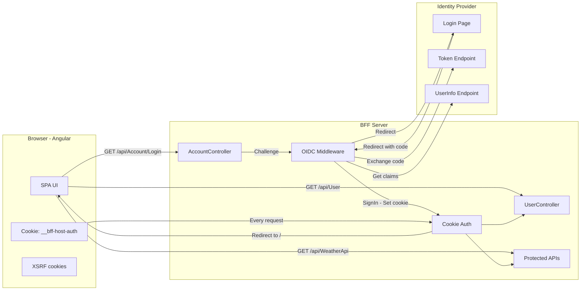
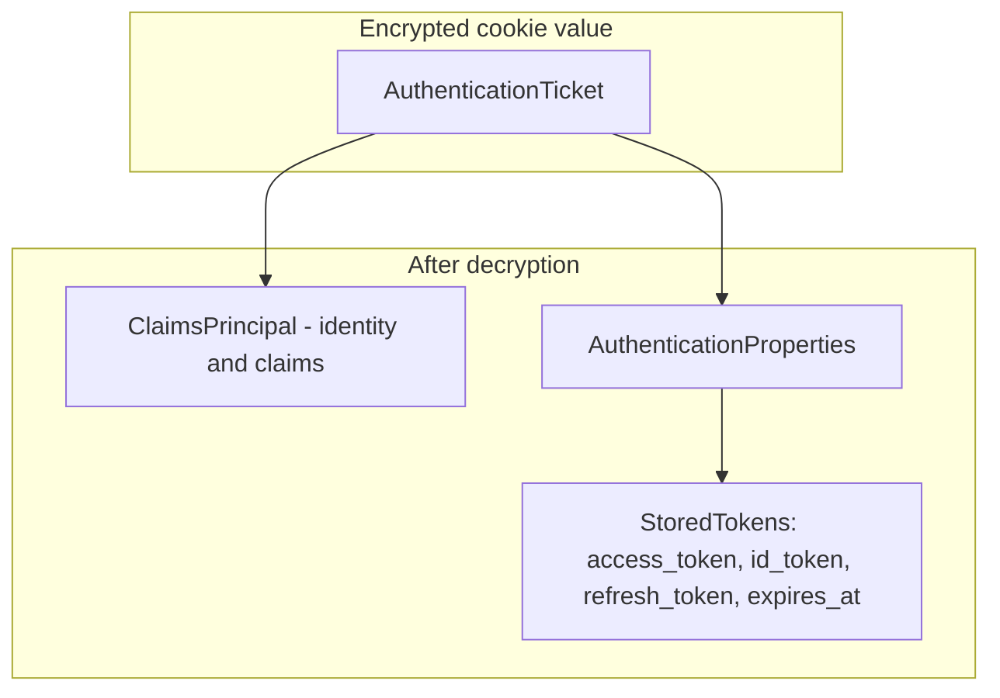
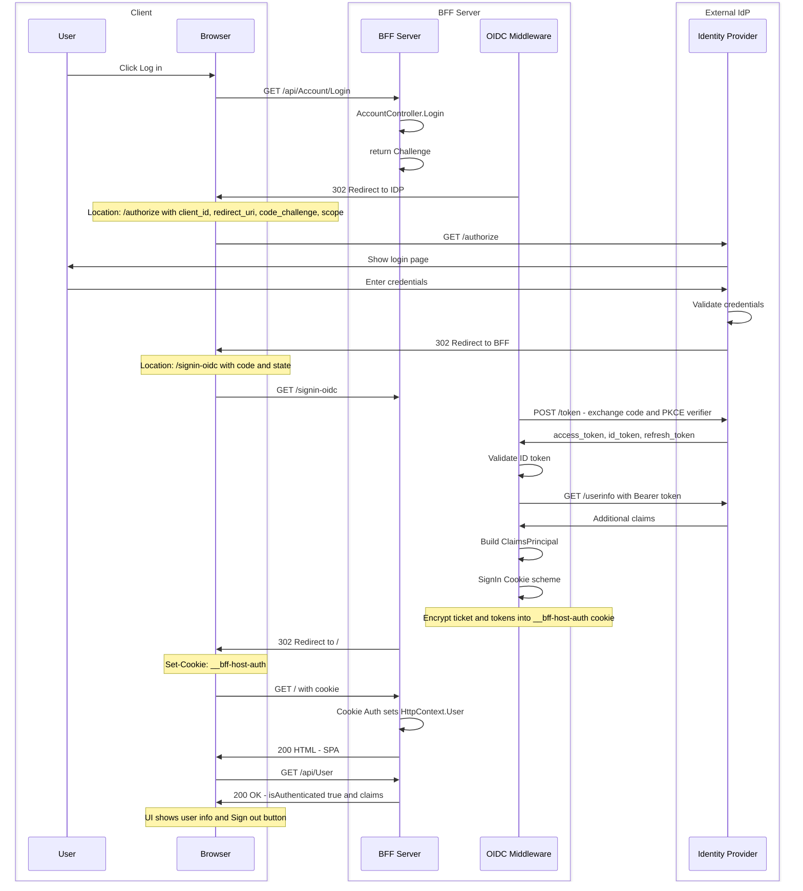
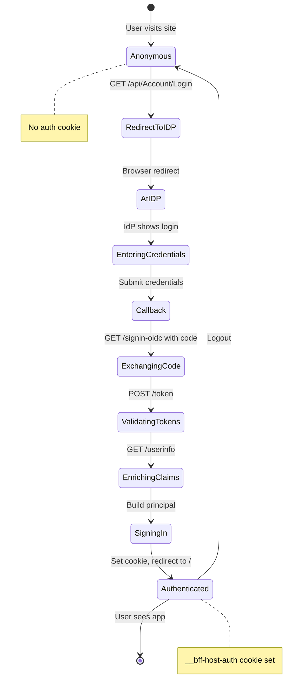
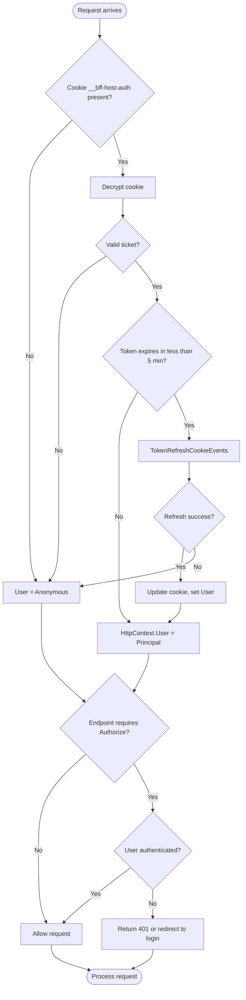
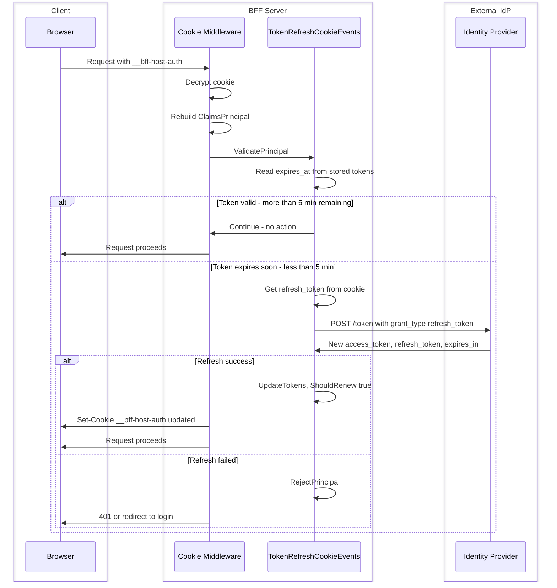
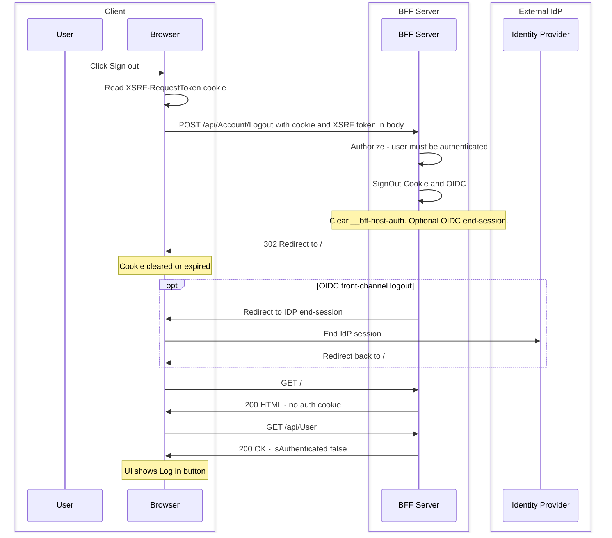
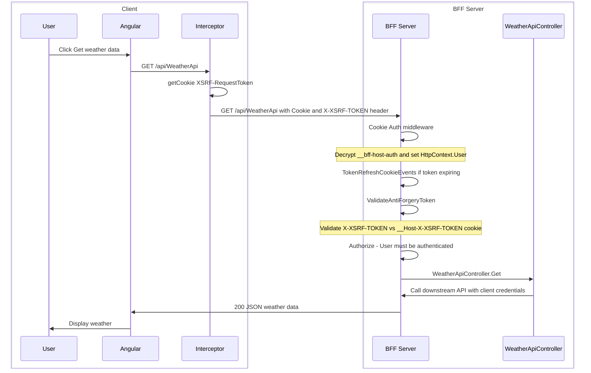
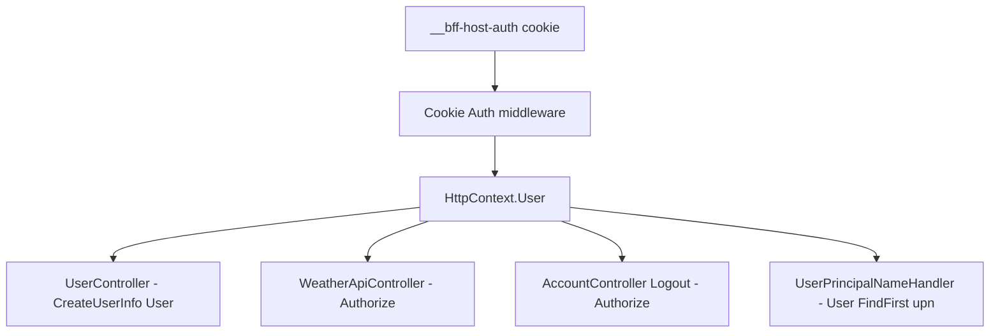

# User Authentication Flow and Cookie Usage

This document describes the user authentication flow in this BFF application and how the **__bff-host-auth** cookie is configured, set, read, validated, and used. It combines flow diagrams with cookie-specific details and code references.

---

## Table of Contents

- [Architecture Overview](#architecture-overview)
- [The Authentication Cookie](#the-authentication-cookie)
- [Login Flow](#login-flow)
- [When the Cookie Is Read and Request Processing](#when-the-cookie-is-read-and-request-processing)
- [Session Validation and Token Refresh](#session-validation-and-token-refresh)
- [Logout Flow](#logout-flow)
- [Protected API Request Flow](#protected-api-request-flow)
- [Where the Authenticated User Is Used](#where-the-authenticated-user-is-used)
- [Endpoints and Cookie Usage](#endpoints-and-cookie-usage)
- [Summary](#summary)

---

## Architecture Overview



---

## The Authentication Cookie

The **__bff-host-auth** cookie is the **session cookie** for this BFF. It holds an **encrypted** authentication ticket (ASP.NET Core Data Protection). The browser never sees the decrypted content; it only sends the opaque cookie on every request to the BFF.

### Cookie configuration

**File:** `server/Program.cs`

```csharp
services.AddAuthentication(options =>
{
    options.DefaultScheme = CookieAuthenticationDefaults.AuthenticationScheme;
    options.DefaultChallengeScheme = OpenIdConnectDefaults.AuthenticationScheme;
})
.AddCookie(options =>
{
    options.Cookie.Name = "__bff-host-auth";
    options.Cookie.SameSite = SameSiteMode.Strict;
    options.Cookie.SecurePolicy = CookieSecurePolicy.Always;
    options.Cookie.HttpOnly = true;
    options.EventsType = typeof(TokenRefreshCookieEvents);
})
.AddOpenIdConnect(options =>
{
    options.SignInScheme = CookieAuthenticationDefaults.AuthenticationScheme;
    options.SaveTokens = true;
    // ...
});
```

| Property    | Value   | Purpose                                      |
|------------|---------|----------------------------------------------|
| Name       | __bff-host-auth | Identifies the session cookie.         |
| HttpOnly   | true    | JavaScript cannot read it; reduces XSS risk. |
| Secure     | true    | Sent only over HTTPS.                        |
| SameSite   | Strict  | Sent only on same-site requests; helps CSRF. |
| EventsType | TokenRefreshCookieEvents | Validation and token refresh on each read. |

**SignInScheme** on OIDC means: after a successful login, OIDC **signs in** to the **Cookie** scheme, which creates or updates the __bff-host-auth cookie. **SaveTokens** means the access, refresh, and ID tokens are stored in the cookie ticket.

### What is stored in the cookie

When decrypted, the cookie contains an **AuthenticationTicket** with:

- **ClaimsPrincipal** – user identity and claims (name, email, roles, upn, etc.).
- **AuthenticationProperties** with **StoredTokens**:
  - **access_token**, **id_token**, **refresh_token**, **expires_at** (used for refresh logic).



### Token isolation from the client

In the **BFF (Backend-for-Frontend) pattern**, the BFF owns the session and holds IdP tokens on behalf of the user. The SPA talks only to the BFF (same origin) and never receives or stores access, ID, or refresh tokens. **Token isolation from the client** is this separation: IdP tokens stay in the BFF and are never exposed to the browser.

1. **HttpOnly cookie** – The **__bff-host-auth** cookie is set with **HttpOnly: true**. The browser stores it and sends it automatically on same-origin requests to the BFF, but **JavaScript cannot read it** (e.g. `document.cookie` does not include it). So the SPA cannot access the cookie payload or any tokens inside it.

2. **Encrypted payload** – The cookie value is an **encrypted** authentication ticket (ASP.NET Core Data Protection). Even if the cookie were somehow readable by script, the content would be ciphertext. Only the BFF server has the key to decrypt it and recover the principal and stored tokens.

3. **Server-side only** – Tokens are decrypted and used only on the BFF: for **Cookie Auth** to set `HttpContext.User`, for **TokenRefreshCookieEvents** to refresh the access token, and for the BFF to call downstream APIs with the access token. The browser never receives raw IdP tokens.

This isolation is a core security benefit of the BFF pattern: tokens stay out of the client’s reach, so an attacker who runs script in the browser (XSS) cannot steal access or refresh tokens, because they are not present in the client at all.

---

## Login Flow

The cookie is **first set** when the user completes the OpenID Connect login flow: after the IdP redirects to **GET /signin-oidc**, the OIDC middleware exchanges the code for tokens, validates them, builds a **ClaimsPrincipal**, and calls **SignIn** with the Cookie scheme. Cookie authentication then serializes the principal and stored tokens into the encrypted ticket and sends **Set-Cookie: __bff-host-auth** with a **302 Redirect** to the return URL (e.g. /).

### Login flow (sequence)



### Login flow (state)



---

## When the Cookie Is Read and Request Processing

The cookie is **read on every request** that includes it (i.e. every same-origin request from the browser to the BFF).

**Middleware order** in `Program.cs`:

```csharp
app.UseAuthentication();
app.UseAuthorization();
app.MapRazorPages();
app.MapControllers();
```

When **UseAuthentication()** runs: the Cookie Authentication middleware looks for **__bff-host-auth**; if present, it **decrypts** the cookie, **deserializes** the ticket, rebuilds **ClaimsPrincipal** and sets **HttpContext.User**, then invokes **TokenRefreshCookieEvents.ValidatePrincipal** (see next section). If validation succeeds (and no refresh was needed, or refresh succeeded), the request continues with **User** set; if **ShouldRenew** was set, the response includes an updated **Set-Cookie**. If the cookie is missing or invalid, **HttpContext.User** remains anonymous.

### Authentication decision flow



---

## Session Validation and Token Refresh

**File:** `server/TokenRefreshCookieEvents.cs`

On each request where the cookie is present, **ValidatePrincipal** runs:

1. Read **expires_at** from the stored tokens in the cookie ticket.
2. If the access token has **more than 5 minutes** left: do nothing; request continues.
3. If the access token **expires in less than 5 minutes** (or is already expired):
   - Get **refresh_token** from the stored tokens.
   - Call the IdP **token endpoint** with **grant_type=refresh_token**.
   - If the IdP returns new tokens: update the ticket, call **context.Properties.StoreTokens(tokens)**, and set **context.ShouldRenew = true**. The Cookie middleware then sends a **new __bff-host-auth** cookie in the response.
   - If refresh fails or there is no refresh token: **context.RejectPrincipal()** – the user is treated as unauthenticated (e.g. 401 on protected endpoints).

So the cookie is both the **source** of the refresh token and the **container** that gets updated when tokens are refreshed.



---

## Logout Flow

The cookie is **cleared** when the user logs out. The server calls **SignOut** with the Cookie scheme, which deletes the __bff-host-auth cookie (e.g. **Set-Cookie: __bff-host-auth=; expires=...**). Subsequent requests no longer send the cookie, and **HttpContext.User** is anonymous until the user logs in again.

**File:** `server/Controllers/AccountController.cs`

```csharp
[Authorize]
[HttpPost("Logout")]
public IActionResult Logout()
{
    return SignOut(
        new AuthenticationProperties { RedirectUri = "/" },
        CookieAuthenticationDefaults.AuthenticationScheme,
        OpenIdConnectDefaults.AuthenticationScheme);
}
```



---

## Protected API Request Flow



---

## Where the Authenticated User Is Used

Once the cookie is read and **HttpContext.User** is set, the authenticated user is used in these places:

| Location | How the cookie user is used |
|----------|-----------------------------|
| **UserController.GetCurrentUser** | Reads **User** (ClaimsPrincipal). If **User.Identity.IsAuthenticated**, returns **UserInfo** with claims; otherwise returns **UserInfo.Anonymous**. The auth cookie drives **isAuthenticated** and **claims** returned to the SPA. |
| **WeatherApiController** | Has **[Authorize]**. If **User** is not authenticated, the request is rejected (e.g. 401). The cookie is **required** to call this API. |
| **AccountController.Logout** | Has **[Authorize]**. Only an authenticated user can call Logout. The cookie is **required** to POST /api/Account/Logout. |
| **UserPrincipalNameHandler** | When the BFF calls the downstream API, it reads **HttpContext.User** and gets the **upn** claim and sends it as the **UPN** header. The auth cookie supplies the user identity forwarded to the backend. |



---

## Endpoints and Cookie Usage

| Endpoint | Cookie required? | Scheme / usage |
|----------|-------------------|----------------|
| GET / | No | If cookie is sent, User is set; SPA can then call /api/User. |
| GET /api/Account/Login | No | Challenge then OIDC; redirect to IdP. |
| GET /signin-oidc | No (handled by OIDC) | After success, **cookie is set** (SignIn Cookie). |
| GET /api/User | No | **AllowAnonymous**. If cookie is sent, User is set and response includes isAuthenticated and claims; if not, anonymous. |
| GET /api/WeatherApi | **Yes** | **Authorize** – cookie must be valid; User used for request and for UPN to downstream API. |
| POST /api/Account/Logout | **Yes** | **Authorize** – cookie must be valid; then SignOut **clears** the cookie. |

---

## Summary

- **Cookie:** __bff-host-auth. **Config:** HttpOnly, Secure, SameSite=Strict; Cookie Auth + TokenRefreshCookieEvents.
- **Set:** When the user completes OIDC login (SignIn Cookie scheme); **updated** when TokenRefreshCookieEvents refreshes tokens (ShouldRenew).
- **Read:** On every request; Cookie Auth decrypts the cookie, sets HttpContext.User, and runs TokenRefreshCookieEvents.ValidatePrincipal (optional token refresh).
- **Used for:** UserController (UserInfo for SPA), WeatherApiController and Logout (Authorize), UserPrincipalNameHandler (UPN to downstream API).
- **Cleared:** When the user calls POST /api/Account/Logout and the server runs SignOut(Cookie scheme).

The authentication cookie is the **only** place the browser stores session state for this BFF; all tokens and identity live inside it on the server side.

All diagrams use Mermaid syntax and will render in GitHub, GitLab, Azure DevOps, and other Markdown viewers that support Mermaid.
