# How All Cookies Work in This BFF Solution

This document explains every cookie used in the application: who sets it, who reads it, what it contains, and how it flows through the request/response cycle.

---

## Table of Contents

- [Overview: Three Cookies](#overview-three-cookies)
- [Cookie 1: `__bff-host-auth` (Authentication)](#cookie-1-__bff-host-auth-authentication)
- [Cookie 2: `__Host-X-XSRF-TOKEN` (XSRF Validation)](#cookie-2-__host-x-xsrf-token-xsrf-validation)
- [Cookie 3: `XSRF-RequestToken` (XSRF Client Copy)](#cookie-3-xsrf-requesttoken-xsrf-client-copy)
- [Cookie Flow Diagrams](#cookie-flow-diagrams)
- [Who Can Read What](#who-can-read-what)
- [Summary Table](#summary-table)

---

## Overview: Three Cookies

| Cookie Name | Purpose | HttpOnly | Set By | Read By |
|-------------|---------|----------|--------|---------|
| **`__bff-host-auth`** | User session (encrypted tokens + identity) | Yes | Cookie Auth middleware | Server only |
| **`__Host-X-XSRF-TOKEN`** | XSRF validation secret (server-side) | Yes | Antiforgery middleware | Server only |
| **`XSRF-RequestToken`** | XSRF token value for client to send in header | No | _Host.cshtml, UserController | Browser (Angular) |

```mermaid
graph LR
    subgraph Server["🖥️ Server"]
        A["__bff-host-auth<br/>HttpOnly"]
        B["__Host-X-XSRF-TOKEN<br/>HttpOnly"]
    end
    
    subgraph Client["🌐 Browser"]
        C["XSRF-RequestToken<br/>Readable by JS"]
    end
    
    Server -->|"Set-Cookie"| Client
    Client -->|"Cookie header"| Server
    C -->|"Read → X-XSRF-TOKEN header"| Server
```



---

## Cookie 1: `__bff-host-auth` (Authentication)

### Purpose

Stores the user’s authenticated session. The cookie value is an **encrypted blob** containing the authentication ticket (tokens + claims). The browser never sees the raw tokens.

### Configuration (Program.cs)

```csharp
.AddCookie(options =>
{
    options.Cookie.Name = "__bff-host-auth";
    options.Cookie.SameSite = SameSiteMode.Strict;
    options.Cookie.SecurePolicy = CookieSecurePolicy.Always;
    options.Cookie.HttpOnly = true;
    options.EventsType = typeof(TokenRefreshCookieEvents);
})
```

| Property | Value | Why |
|----------|-------|-----|
| **Name** | `__bff-host-auth` | `__Host-` prefix (when used) implies Secure, no Path, host-only. Here it’s just a name. |
| **HttpOnly** | `true` | JavaScript cannot read it → reduces XSS token theft. |
| **Secure** | `true` | Sent only over HTTPS. |
| **SameSite** | `Strict` | Sent only on same-site requests → helps prevent CSRF. |

### When It Is Set

- **Set:** After successful OIDC login, when the app calls `SignIn()` (inside the OIDC middleware after token exchange).
- **Updated:** When `TokenRefreshCookieEvents` refreshes tokens and sets `context.ShouldRenew = true`.
- **Removed:** On logout when the app calls `SignOut()`.

### What’s Inside (Encrypted)

The cookie is an ASP.NET Core Data Protection encrypted payload. Decrypted, it conceptually contains:

- **AuthenticationTicket**
  - **ClaimsPrincipal** (user identity: name, email, roles, etc.)
  - **AuthenticationProperties**
    - Stored tokens: `access_token`, `id_token`, `refresh_token`, `expires_at`

The browser only ever sees the encrypted string.

### Who Reads It

- **Server only.** On every request, the Cookie Authentication middleware:
  1. Reads the `__bff-host-auth` cookie from the request.
  2. Decrypts it and rebuilds `ClaimsPrincipal` + tokens.
  3. Sets `HttpContext.User`.
  4. Optionally runs `TokenRefreshCookieEvents` to refresh tokens and re-issue the cookie.

JavaScript cannot read this cookie.

### Request Flow

```
Browser sends:  Cookie: __bff-host-auth=CfDJ8N...long_encrypted_string...
Server:         Decrypts → HttpContext.User = ClaimsPrincipal
                If token expiring soon → refresh → Set-Cookie again
```

---

## Cookie 2: `__Host-X-XSRF-TOKEN` (XSRF Validation)

### Purpose

Holds the **secret** part of the antiforgery token. The server uses it to validate that a request (with a matching token in the header) was generated by the same site and not by a cross-site forger.

### Configuration (Program.cs)

```csharp
services.AddAntiforgery(options =>
{
    options.HeaderName = "X-XSRF-TOKEN";
    options.Cookie.Name = "__Host-X-XSRF-TOKEN";
    options.Cookie.SameSite = SameSiteMode.Strict;
    options.Cookie.SecurePolicy = CookieSecurePolicy.Always;
});
```

| Property | Value | Why |
|----------|-------|-----|
| **Name** | `__Host-X-XSRF-TOKEN` | `__Host-` prefix: cookie must be Secure, Path=/, and not set from a subdomain. |
| **HttpOnly** | `true` (default) | JavaScript cannot read it; only the server uses it. |
| **Secure** | `true` | HTTPS only. |
| **SameSite** | `Strict` | Same-site only. |

### When It Is Set

- **Set:** When the antiforgery system first generates a token, e.g. when:
  - `IAntiforgery.GetAndStoreTokens(HttpContext)` is called (_Host.cshtml, UserController).
- The middleware stores the secret in this cookie and makes the corresponding “request token” available to the app (which then puts that value into `XSRF-RequestToken` for the client).

### What’s Inside

- Opaque secret value used to validate the token sent in the `X-XSRF-TOKEN` header. The server checks that the header value and this cookie belong to the same token pair.

### Who Reads It

- **Server only.** During validation of a request (e.g. `[ValidateAntiForgeryToken]` or `AutoValidateAntiforgeryTokenAttribute`):
  1. Server reads `__Host-X-XSRF-TOKEN` from the request cookies.
  2. Server reads `X-XSRF-TOKEN` from the request header.
  3. Server verifies they match the same antiforgery token.

JavaScript cannot read this cookie.

---

## Cookie 3: `XSRF-RequestToken` (XSRF Client Copy)

### Purpose

Holds the **request token** value that the client must send back in the `X-XSRF-TOKEN` header. Because this cookie is **not** HttpOnly, Angular can read it and attach it to API requests.

### When It Is Set

**1. When the SPA shell is served (_Host.cshtml)**

```csharp
var xsrf = antiForgery.GetAndStoreTokens(HttpContext);
var requestToken = xsrf.RequestToken;
Response.Cookies.Append("XSRF-RequestToken", requestToken ?? "",
    new CookieOptions()
    {
        HttpOnly = false,   // So JavaScript can read it
        IsEssential = true,
        Secure = true,
        SameSite = SameSiteMode.Strict
    });
```

So on the first load of `/`, the browser gets both:
- `__Host-X-XSRF-TOKEN` (secret, HttpOnly)
- `XSRF-RequestToken` (request token, readable)

**2. When the user is fetched (UserController)**

```csharp
[HttpGet]
[AllowAnonymous]
public IActionResult GetCurrentUser()
{
    var tokens = _antiforgery.GetAndStoreTokens(HttpContext);
    Response.Cookies.Append("XSRF-RequestToken", tokens.RequestToken ?? "",
        new CookieOptions { HttpOnly = false, IsEssential = true, Secure = true, SameSite = SameSiteMode.Strict });
    return Ok(CreateUserInfo(User));
}
```

So every time the client calls `/api/User`, the server can refresh the XSRF token and update `XSRF-RequestToken` (e.g. after login, when identity changes).

### What’s Inside

- The same “request token” string that the server expects in the `X-XSRF-TOKEN` header. It matches the secret in `__Host-X-XSRF-TOKEN`.

### Who Reads It

- **Browser (Angular).** The SPA reads this cookie and sends its value in the `X-XSRF-TOKEN` header for API requests.

**Angular code (getCookie.ts):**

```typescript
export const getCookie = (cookieName: string) => {
  const name = `${cookieName}=`;
  const decodedCookie = decodeURIComponent(document.cookie);
  const ca = decodedCookie.split(";");
  for (let i of ca) {
    let c = i.trim();
    if (c.startsWith(name)) {
      return c.substring(name.length, c.length);
    }
  }
  return "";
};
```

**Usage (secure-api.interceptor.ts):**

```typescript
request = request.clone({
  headers: request.headers.set(
    'X-XSRF-TOKEN',
    getCookie('XSRF-RequestToken')
  ),
});
```

So: **Angular reads `XSRF-RequestToken` from `document.cookie` and sends it as `X-XSRF-TOKEN`** on every request to `/api/*`.

### Why Two XSRF Cookies?

| Cookie | HttpOnly | Purpose |
|--------|----------|---------|
| `__Host-X-XSRF-TOKEN` | Yes | Server’s secret; attacker’s site cannot read it. |
| `XSRF-RequestToken` | No | Client’s copy; attacker’s site cannot read it (same-origin). |

On a real request from your app:

1. Browser sends both cookies (same-origin).
2. Browser sends header `X-XSRF-TOKEN: <value from XSRF-RequestToken>` (because your JS set it).
3. Server checks that the header value matches the token pair for `__Host-X-XSRF-TOKEN`.

On a forged request from an attacker’s site:

1. Browser may send cookies (if SameSite allowed it, but Strict blocks cross-site).
2. Attacker cannot read `XSRF-RequestToken` (same-origin policy).
3. So attacker cannot set `X-XSRF-TOKEN` to a valid value → validation fails.

---

## Cookie Flow Diagrams

### First Visit (No Auth)


### After Login

```mermaid
sequenceDiagram
    participant Browser
    participant Server
    participant IDP

    Browser->>Server: GET /api/Account/Login
    Server->>IDP: Redirect to authorize
    IDP->>Browser: Login page → user signs in
    IDP->>Server: Redirect /signin-oidc?code=...
    Server->>Server: Exchange code, validate, SignIn()
    Server->>Browser: 302 / + Set-Cookie: __bff-host-auth=...
    Note over Browser: Now has auth cookie + XSRF cookies

    Browser->>Server: GET /
    Note over Browser: Cookie: __bff-host-auth; XSRF-RequestToken; __Host-X-XSRF-TOKEN
    Server->>Browser: 200 HTML

    Browser->>Server: GET /api/User
    Note over Browser: Cookie: all three<br/>Header: X-XSRF-TOKEN
    Server->>Server: Decrypt __bff-host-auth → User
    Server->>Server: Validate XSRF
    Server->>Browser: 200 { isAuthenticated: true, claims: [...] }
```

### Logout Form (HTML)

Logout is a form POST. The form includes the XSRF token so the server can validate it:

```html
<form method="post" action="api/Account/Logout">
  <button type="submit">Sign out</button>
  <input type="hidden" name="__RequestVerificationToken" [value]="getXsrfToken()" />
</form>
```

- `getXsrfToken()` returns `getCookie('XSRF-RequestToken')`.
- Browser sends that value as `__RequestVerificationToken` in the body (and still sends cookies).
- Server validates antiforgery and then runs `SignOut()`, which clears the auth cookie (and optionally the XSRF cookies depending on config).

---

## Who Can Read What

| Cookie | Browser (JS) | Server |
|--------|--------------|--------|
| `__bff-host-auth` | No (HttpOnly) | Yes – decrypts and sets `HttpContext.User` |
| `__Host-X-XSRF-TOKEN` | No (HttpOnly) | Yes – validates with `X-XSRF-TOKEN` header |
| `XSRF-RequestToken` | Yes – `document.cookie` / `getCookie('XSRF-RequestToken')` | Yes – but validation uses the __Host- cookie + header |

---

## Summary Table

| Cookie | Set By | When Set | Read By | Used For |
|--------|--------|----------|---------|----------|
| **`__bff-host-auth`** | Cookie Auth middleware | After login; refreshed on token refresh | Server only | Session, `HttpContext.User`, tokens |
| **`__Host-X-XSRF-TOKEN`** | Antiforgery (when `GetAndStoreTokens` is used) | First token generation / refresh | Server only | XSRF validation (with header) |
| **`XSRF-RequestToken`** | _Host.cshtml, UserController | Every SPA load; every `/api/User` call | Angular via `getCookie()` | Value for `X-XSRF-TOKEN` header |

All three cookies use **Secure** and **SameSite=Strict**. Only `XSRF-RequestToken` is non-HttpOnly so the client can send the XSRF token in the `X-XSRF-TOKEN` header and in the logout form’s `__RequestVerificationToken` field.
