# How Nonce Values Work in This BFF Solution

This document explains how **CSP nonces** (Content Security Policy nonces) are generated, injected, and used so that only trusted scripts and styles can run.

---

## Table of Contents

- [What Is a Nonce?](#what-is-a-nonce)
- [Overview: Nonce Flow](#overview-nonce-flow)
- [Where the Nonce Is Generated](#where-the-nonce-is-generated)
- [Where the Nonce Is Injected](#where-the-nonce-is-injected)
- [How the CSP Header Uses the Nonce](#how-the-csp-header-uses-the-nonce)
- [How Angular Uses the Nonce](#how-angular-uses-the-nonce)
- [Request Lifecycle](#request-lifecycle)
- [Development vs Production](#development-vs-production)
- [Summary Table](#summary-table)

---

## What Is a Nonce?

A **nonce** (“number used once”) is a random value generated **per request**. It is used with **Content Security Policy (CSP)** so that:

- The server adds a header like: `Content-Security-Policy: script-src 'nonce-abc123xyz'`
- Only `<script nonce="abc123xyz">` (and `<link nonce="abc123xyz">` for styles) are allowed to execute or load.
- Injected scripts (e.g. from XSS) do not have the nonce, so the browser blocks them.

So the nonce is **not stored in a cookie**. It is:

1. Generated once per request on the server.
2. Injected into the HTML (meta tag, script/link tags).
3. Used in the CSP response header.
4. Read by Angular from the meta tag and provided to the framework for dynamically created scripts.

---

## Overview: Nonce Flow

```mermaid
graph TB
    subgraph Server["🖥️ Server"]
        A["Request arrives"]
        B["_Host.cshtml runs"]
        C["GetNonce() → random value"]
        D["Store nonce for this request"]
        E["Replace placeholders in HTML"]
        F["UseSecurityHeaders() adds CSP"]
        G["CSP: script-src 'nonce-XXX'"]
    end
    
    subgraph Response["Response"]
        H["HTML with nonce in meta + script/link"]
        I["Header: Content-Security-Policy"]
    end
    
    subgraph Browser["🌐 Browser"]
        J["Parse HTML"]
        K["Read meta[CSP_NONCE]"]
        L["Angular: provide CSP_NONCE"]
        M["Scripts with nonce execute"]
    end
    
    A --> B --> C --> D --> E --> F --> G
    D --> F
    E --> H
    G --> I
    H --> J --> K --> L --> M
    I --> M
```



---

## Where the Nonce Is Generated

**File:** `server/Pages/_Host.cshtml`

```csharp
var nonce = HttpContext.GetNonce();
```

- **`GetNonce()`** is an extension method on `HttpContext` from **NetEscapades.AspNetCore.SecurityHeaders**.
- It returns a **cryptographically random base64-like string** (e.g. `"R2dG3kL9..."`).
- The value is **per request**: each request gets a new nonce.
- The library stores this nonce in the request/response context so that when the security headers middleware runs, it can put the **same** value into the `Content-Security-Policy` header (via `WithNonce()`).

So:

1. **First use** of the nonce in the pipeline is in `_Host.cshtml` when we call `GetNonce()`.
2. The same value is later used when the security headers middleware adds the CSP header (see [How the CSP Header Uses the Nonce](#how-the-csp-header-uses-the-nonce)).

---

## Where the Nonce Is Injected

**File:** `server/Pages/_Host.cshtml`

The nonce is injected into the HTML in three places.

### 1. Replace Placeholder in Full HTML

```csharp
source = source.Replace("**PLACEHOLDER_NONCE_SERVER**", nonce);
```

This replaces **every** occurrence of `**PLACEHOLDER_NONCE_SERVER**` in the HTML (from `index.html`) with the real nonce. That includes:

- The meta tag (see below).
- The `ngCspNonce` attribute on `<app-root>` (see below).

### 2. Meta Tag (in index.html)

**Source (index.html):**

```html
<meta name="CSP_NONCE" content="**PLACEHOLDER_NONCE_SERVER**" />
```

**After replace:**

```html
<meta name="CSP_NONCE" content="R2dG3kL9..." />
```

Angular reads this in `app.config.ts` and provides it as `CSP_NONCE` so that any script/style tags Angular creates at runtime can use the same nonce.

### 3. app-root (in index.html)

**Source (index.html):**

```html
<app-root ngCspNonce="**PLACEHOLDER_NONCE_SERVER**"></app-root>
```

**After replace:**

```html
<app-root ngCspNonce="R2dG3kL9..."></app-root>
```

Angular uses this so the root component knows the nonce for CSP (e.g. for dynamically added scripts).

### 4. Vite Dev Script (Development Only)

```csharp
if (hostEnvironment.IsDevelopment())
{
    var viteScriptToUpdate = """<script type="module" src="/@vite/client"></script>""";
    source = source.Replace(viteScriptToUpdate,
        $"""<script type="module" src="/@vite/client" nonce="{nonce}"></script>""");
}
```

So in dev, the Vite client script tag gets an explicit `nonce="..."` so it is allowed by CSP.

### 5. Stylesheet Links

```csharp
var nonceLinkStyle = $"<link nonce=\"{nonce}\" rel=\"stylesheet";
source = source.Replace("<link rel=\"stylesheet", nonceLinkStyle);
```

Every `<link rel="stylesheet"` becomes `<link nonce="R2dG3kL9..." rel="stylesheet"` so stylesheets are allowed when CSP uses `style-src 'nonce-...'` (in production).

---

## How the CSP Header Uses the Nonce

**File:** `server/SecurityHeadersDefinitions.cs`

```csharp
builder.AddContentSecurityPolicy(builder =>
{
    // ...
    if (isDev)
    {
        builder.AddStyleSrc().Self().UnsafeInline();
    }
    else
    {
        builder.AddStyleSrc().WithNonce().UnsafeInline();
    }

    builder.AddScriptSrcElem().WithNonce().UnsafeInline();
    builder.AddScriptSrc().WithNonce().UnsafeInline();
});
```

- **`WithNonce()`** tells the NetEscapades middleware to add a **nonce** to the CSP directive for this request.
- The middleware uses the **same nonce** that was (or will be) returned by `HttpContext.GetNonce()` for this request.
- The resulting header looks like:

  ```
  Content-Security-Policy: script-src 'nonce-R2dG3kL9...' 'unsafe-inline'; style-src 'nonce-R2dG3kL9...' 'unsafe-inline'; ...
  ```

So:

- **Scripts:** Only `<script>` tags that have `nonce="R2dG3kL9..."` (matching the header) are allowed.
- **Styles:** In production, only `<link rel="stylesheet">` (and inline styles) with that nonce are allowed when `style-src` uses `WithNonce()`.

The nonce in the **response header** and the nonce in the **HTML** are the same value for that request.

---

## How Angular Uses the Nonce

**File:** `ui/src/app/app.config.ts`

```typescript
const nonce = (
  document.querySelector('meta[name="CSP_NONCE"]') as HTMLMetaElement
)?.content;

export const appConfig: ApplicationConfig = {
  providers: [
    // ...
    {
      provide: CSP_NONCE,
      useValue: nonce,
    },
  ],
};
```

- When the app boots, it reads the nonce from `<meta name="CSP_NONCE" content="...">` (already replaced by the server).
- It provides that value as **`CSP_NONCE`** so Angular can add `nonce="..."` to any **dynamically created** script or style tags (e.g. for lazy-loaded bundles or inline styles).
- Without this, those dynamic tags would not match the CSP `nonce-...` and would be blocked.

So:

- **Server:** Puts nonce in meta tag and in CSP header.
- **Browser:** Loads HTML, runs your app.
- **Angular:** Reads nonce from meta, provides it via `CSP_NONCE`.
- **Angular runtime:** Uses that nonce on dynamic script/style elements so they comply with CSP.

---

## Request Lifecycle


---

## Development vs Production

| Aspect | Development | Production |
|--------|-------------|------------|
| **Style CSP** | `style-src 'self' 'unsafe-inline'` (no nonce) | `style-src 'nonce-XXX' 'unsafe-inline'` |
| **Script CSP** | `script-src 'nonce-XXX' 'unsafe-inline'` | `script-src 'nonce-XXX' 'unsafe-inline'` |
| **Vite script** | _Host explicitly adds `nonce="..."` to Vite client script | N/A (no Vite in prod) |
| **Link tags** | _Host still adds nonce to `<link rel="stylesheet"` | Same; required when CSP uses nonce for styles |

In development, styles use `'self' 'unsafe-inline'` so you don’t need nonces on every dev-only stylesheet (e.g. from the dev server). Scripts still use nonce so that only your intended scripts run.

---

## Summary Table

| Step | Where | What Happens |
|------|--------|--------------|
| **Generate** | `_Host.cshtml` | `HttpContext.GetNonce()` → one random value per request |
| **Store** | NetEscapades (internal) | Same value used when adding CSP header |
| **Inject (meta)** | `_Host.cshtml` | Replace `**PLACEHOLDER_NONCE_SERVER**` in `<meta name="CSP_NONCE" content="...">` |
| **Inject (app-root)** | `_Host.cshtml` | Replace placeholder in `<app-root ngCspNonce="...">` |
| **Inject (script/link)** | `_Host.cshtml` | Add `nonce="..."` to Vite script and to `<link rel="stylesheet"` |
| **CSP header** | Security headers middleware | `Content-Security-Policy: script-src 'nonce-XXX' ...` (same XXX) |
| **Angular read** | `app.config.ts` | `document.querySelector('meta[name="CSP_NONCE"]')?.content` |
| **Angular use** | Framework | `provide(CSP_NONCE, nonce)` so dynamic scripts/styles get the nonce |

---

## Important Points

1. **Nonce is not a cookie** – It is generated per request and only appears in the HTML and in the CSP response header.
2. **Same value everywhere** – `GetNonce()` and `WithNonce()` use the same value for that request so the header and the tags match.
3. **Different every request** – Each full page load gets a new nonce, which limits the usefulness of a leaked nonce.
4. **Angular must have the nonce** – The meta tag and `CSP_NONCE` provider ensure Angular can add the nonce to any script/style it creates, so CSP doesn’t block the app.
