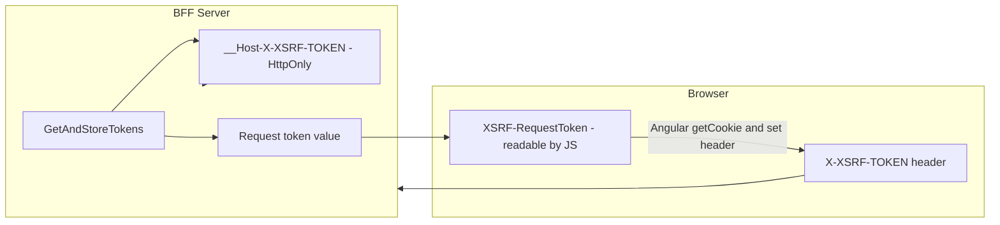
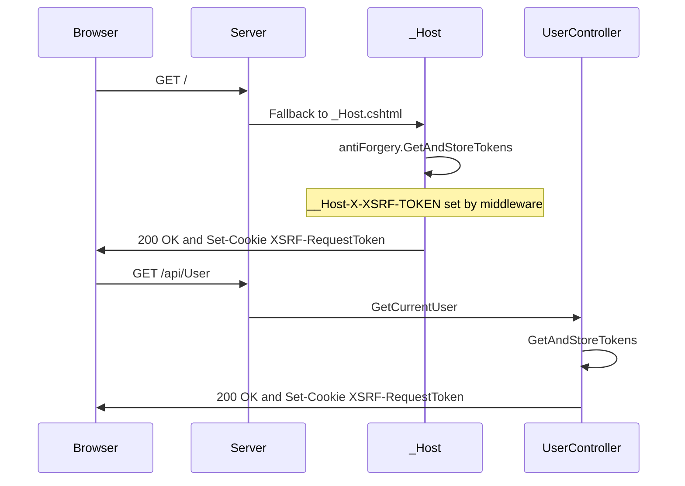
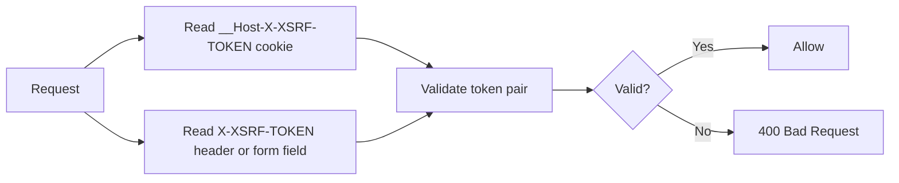
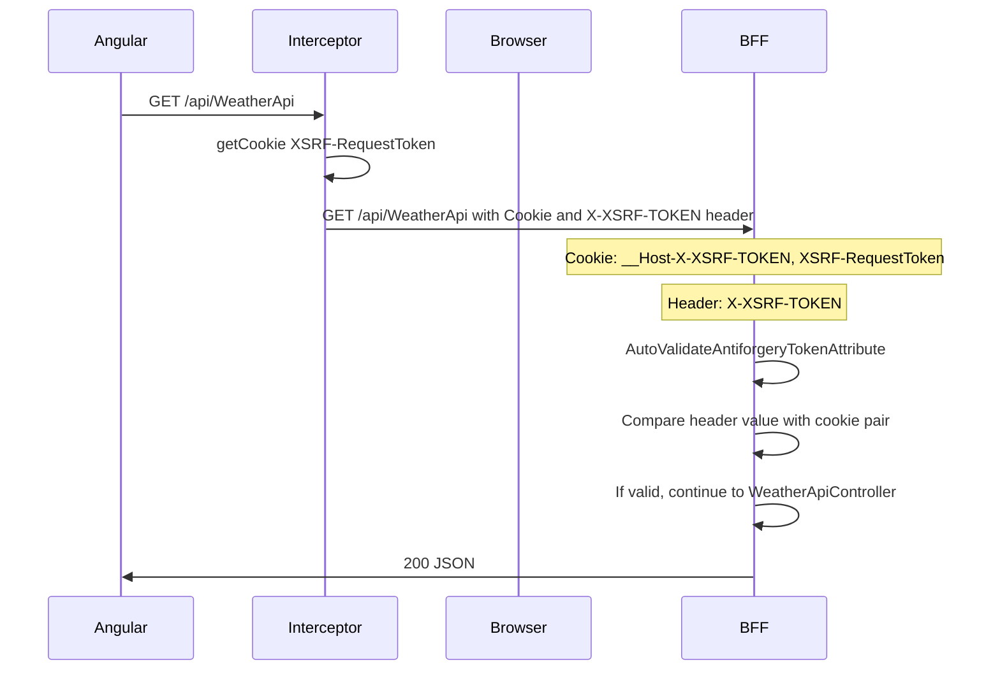
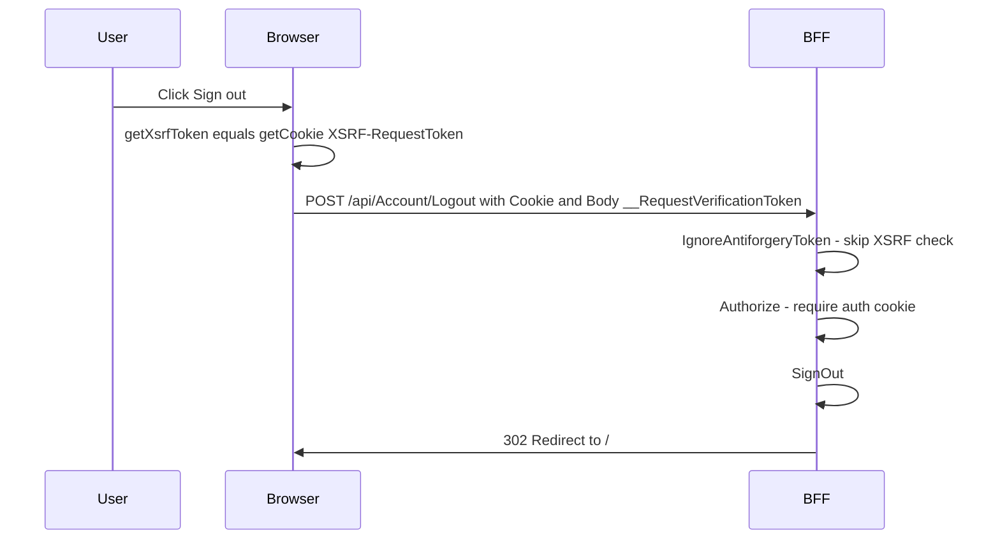

# How XSRF Cookies Are Used in This Application

This document explains how the two XSRF-related cookies work, where they are set, how the client sends the token, and how the server validates it.

---

## Table of Contents

- [Overview: Two Cookies, One Token Pair](#overview-two-cookies-one-token-pair)
- [Server Configuration](#server-configuration)
- [Where XSRF Tokens Are Generated and Set](#where-xsrf-tokens-are-generated-and-set)
- [How the Client Sends the Token](#how-the-client-sends-the-token)
- [Why Not Angular's Default XSRF?](#why-not-angulars-default-xsrf)
- [How the Server Validates](#how-the-server-validates)
- [Request Flow: API Call with XSRF](#request-flow-api-call-with-xsrf)
- [Request Flow: Logout Form with XSRF](#request-flow-logout-form-with-xsrf)
- [Endpoints: Where XSRF Is Required or Skipped](#endpoints-where-xsrf-is-required-or-skipped)
- [Why Two Cookies](#why-two-cookies)
- [Summary](#summary)

---

## Overview: Two Cookies, One Token Pair

The app uses ASP.NET Core Antiforgery (XSRF/CSRF protection) with **two cookies** that form one token pair:

| Cookie Name              | HttpOnly | Set By                    | Read By   | Purpose                          |
|--------------------------|----------|---------------------------|-----------|----------------------------------|
| **__Host-X-XSRF-TOKEN**  | Yes      | Antiforgery (internal)    | Server    | Secret used to validate the pair |
| **XSRF-RequestToken**    | No       | _Host.cshtml, UserController | Angular | Request token value for header    |

Validation: the server checks that the value in the **X-XSRF-TOKEN** header matches the token pair associated with the **__Host-X-XSRF-TOKEN** cookie. The **XSRF-RequestToken** cookie exists so JavaScript can read it and send that value in the header.



---

## Server Configuration

**File:** `server/Program.cs`

```csharp
services.AddAntiforgery(options =>
{
    options.HeaderName = "X-XSRF-TOKEN";
    options.Cookie.Name = "__Host-X-XSRF-TOKEN";
    options.Cookie.SameSite = SameSiteMode.Strict;
    options.Cookie.SecurePolicy = CookieSecurePolicy.Always;
});
```

- **HeaderName:** The server expects the request token in the **X-XSRF-TOKEN** HTTP header.
- **Cookie.Name:** The antiforgery secret is stored in the **__Host-X-XSRF-TOKEN** cookie (HttpOnly by default). The __Host- prefix implies Secure, Path=/, host-only.
- **SameSite, Secure:** Same as other cookies; sent only on same-site, HTTPS requests.

Global validation is applied to all non-GET requests (and GET if you use the default behavior) via:

```csharp
services.AddControllersWithViews(options =>
    options.Filters.Add(new AutoValidateAntiforgeryTokenAttribute()));
```

So by default, **all state-changing requests** to controllers are validated for XSRF unless an action or controller opts out (e.g. with `[IgnoreAntiforgeryToken]`).

---

## Where XSRF Tokens Are Generated and Set

Tokens are generated when **GetAndStoreTokens(HttpContext)** is called. The middleware then sets **__Host-X-XSRF-TOKEN** and exposes the **request token** so the app can send it to the client.

### 1. When the SPA Shell Is Served

**File:** `server/Pages/_Host.cshtml`

```csharp
var xsrf = antiForgery.GetAndStoreTokens(HttpContext);
var requestToken = xsrf.RequestToken;
Response.Cookies.Append("XSRF-RequestToken", requestToken ?? "",
    new CookieOptions()
    {
        HttpOnly = false,
        IsEssential = true,
        Secure = true,
        SameSite = SameSiteMode.Strict
    });
```

- **GetAndStoreTokens** generates a new token pair and stores the secret (e.g. in the __Host-X-XSRF-TOKEN cookie).
- The app appends **XSRF-RequestToken** with the **request token** value so the browser (and thus Angular) can read it.

So on **every full page load** (e.g. GET /), the client receives both cookies and can use the request token for subsequent API calls.

### 2. When the User Endpoint Is Called

**File:** `server/Controllers/UserController.cs`

```csharp
[HttpGet]
[AllowAnonymous]
public IActionResult GetCurrentUser()
{
    var tokens = _antiforgery.GetAndStoreTokens(HttpContext);
    Response.Cookies.Append("XSRF-RequestToken", tokens.RequestToken ?? "",
        new CookieOptions { HttpOnly = false, IsEssential = true, Secure = true, SameSite = SameSiteMode.Strict });
    return Ok(CreateUserInfo(User));
}
```

- Each call to **GET /api/User** regenerates the token pair and **refreshes XSRF-RequestToken**.
- This keeps the token in sync after login (when identity changes) and gives the client a fresh request token for the next requests.



---

## How the Client Sends the Token

### For API Requests (e.g. GET /api/WeatherApi)

**File:** `ui/src/app/secure-api.interceptor.ts`

The interceptor runs for every request whose URL starts with the API base (e.g. same-origin `/api/`). It reads the request token from the cookie and sets the header:

```typescript
request = request.clone({
  headers: request.headers.set(
    'X-XSRF-TOKEN',
    getCookie('XSRF-RequestToken')
  ),
});
```

**File:** `ui/src/app/getCookie.ts`

```typescript
export const getCookie = (cookieName: string) => {
  const name = `${cookieName}=`;
  const decodedCookie = decodeURIComponent(document.cookie);
  const ca = decodedCookie.split(";");
  for (let i of ca) {
    let c = i.trimStart();
    if (c.startsWith(name)) {
      return c.substring(name.length, c.length);
    }
  }
  return "";
};
```

So for **all requests to /api/** (same origin), the client sends:

- **Cookie:** `XSRF-RequestToken=<value>` (and automatically **__Host-X-XSRF-TOKEN**)
- **Header:** `X-XSRF-TOKEN: <same value as XSRF-RequestToken>`

### Why Not Angular's Default XSRF?

Angular's [built-in XSRF protection](https://angular.dev/best-practices/security#httpclient-xsrf-csrf-security) reads a cookie named **`XSRF-TOKEN`** (configurable) and sends it in the **`X-XSRF-TOKEN`** header—but **only on mutating requests** (POST, PUT, PATCH, DELETE). It does **not** add the header to GET or HEAD requests.

This solution **validates XSRF on GET** for protected APIs (e.g. `WeatherApiController` uses `[ValidateAntiForgeryToken]` at controller level, so even `GET /api/WeatherApi` must include a valid token). If the client used Angular's default implementation, those GET requests would not send `X-XSRF-TOKEN`, and the BFF would reject them with 400.

So the app uses a **custom interceptor** (`secure-api.interceptor.ts`) that adds the `X-XSRF-TOKEN` header to **all** requests to `/api/` (including GET), and uses a separate cookie name (**`XSRF-RequestToken`**) to avoid relying on Angular's built-in behavior. The server sets that cookie name in `_Host.cshtml` and `UserController` to match.

**Summary:** Angular's default is "token only on mutating requests"; this BFF requires the token on GET as well, so the default cannot be used as-is.

### For Logout (Form POST)

**File:** `ui/src/app/home.component.html`

```html
<form method="post" action="api/Account/Logout">
  <button type="submit">Sign out</button>
  <input type="hidden" name="__RequestVerificationToken" [value]="getXsrfToken()" />
</form>
```

**File:** `ui/src/app/home.component.ts`

```typescript
getXsrfToken(): string {
  return getCookie('XSRF-RequestToken');
}
```

- The form POST sends the token in the **body** as **__RequestVerificationToken** (ASP.NET Core’s default form field name for antiforgery).
- The **Logout** action uses **IgnoreAntiforgeryToken** (see below), so XSRF is not actually validated for Logout; the form still sends the token for consistency and in case the attribute is removed later.

---

## How the Server Validates

1. On a request that is subject to antiforgery validation (e.g. most non-GET controller actions, unless skipped):
   - The **AutoValidateAntiforgeryTokenAttribute** (or **ValidateAntiForgeryToken**) runs.
2. The antiforgery system:
   - Reads the **__Host-X-XSRF-TOKEN** cookie (secret).
   - Reads the request token from either:
     - The **X-XSRF-TOKEN** header (used by Angular for API calls), or
     - The **__RequestVerificationToken** form field (used by the logout form).
3. It verifies that the header/form value and the cookie belong to the **same token pair**.
4. If they match, the request is allowed; otherwise validation fails (e.g. 400).



---

## Request Flow: API Call with XSRF

Example: GET /api/WeatherApi (or any other API call that goes through the interceptor).



---

## Request Flow: Logout Form with XSRF

The logout form sends the token in the body; in this app Logout does **not** validate XSRF (see next section).



---

## Endpoints: Where XSRF Is Required or Skipped

| Endpoint                  | Method | XSRF validation                         | Why |
|---------------------------|--------|-----------------------------------------|-----|
| /api/Account/Login        | GET    | Not applied (GET)                       | Read-only; starts OIDC redirect. |
| /api/Account/Logout       | POST   | **Skipped** via **IgnoreAntiforgeryToken** | Logout requires [Authorize]; token can change after login. |
| /api/User                 | GET    | Not applied (GET)                       | Read-only. |
| /api/WeatherApi           | GET    | **Applied** (ValidateAntiForgeryToken on controller) | Protected API; GET still validated by attribute. |

**WeatherApiController:**

```csharp
[ValidateAntiForgeryToken]
[Authorize(...)]
[Route("api/[controller]")]
public class WeatherApiController : ControllerBase
```

**AccountController Logout:**

```csharp
[Authorize]
[IgnoreAntiforgeryToken]
[HttpPost("Logout")]
public IActionResult Logout() { ... }
```

So: **XSRF cookie and header are used for protected API calls** (e.g. WeatherApi). **Logout** intentionally skips XSRF and relies on **Authorize** (auth cookie) instead.

---

## Why Two Cookies

| Cookie                    | HttpOnly | Role |
|---------------------------|----------|------|
| **__Host-X-XSRF-TOKEN**   | Yes      | Holds the secret. JavaScript and other sites cannot read it. |
| **XSRF-RequestToken**     | No       | Holds the value the client must send in X-XSRF-TOKEN. Only your origin can read it. |

On a **legitimate** request from your app:

1. Browser sends both cookies (same origin).
2. Your script reads **XSRF-RequestToken** and sets **X-XSRF-TOKEN**.
3. Server validates header against the secret in **__Host-X-XSRF-TOKEN** and allows the request.

On a **forged** request from another site:

1. Attacker cannot read **XSRF-RequestToken** (same-origin policy).
2. Attacker cannot set **X-XSRF-TOKEN** to a valid value.
3. Validation fails even if the browser sends the __Host- cookie (e.g. under older SameSite behavior), because the header will be missing or wrong.

So the **XSRF cookie** (the pair: __Host- cookie + request token sent in header or form) is used to ensure that state-changing or sensitive API requests originate from your own front-end, not from a cross-site forger.

---

## Summary

- **Two cookies:** **__Host-X-XSRF-TOKEN** (secret, HttpOnly) and **XSRF-RequestToken** (request token, readable by JS).
- **Set when:** _Host.cshtml on every SPA load; UserController on every GET /api/User.
- **Client:** Angular reads **XSRF-RequestToken** via **getCookie** and sends it in the **X-XSRF-TOKEN** header for all **/api/** requests (secure-api interceptor). Logout form sends it as **__RequestVerificationToken** in the body.
- **Server:** Antiforgery validates **X-XSRF-TOKEN** (or form field) against **__Host-X-XSRF-TOKEN**. **ValidateAntiForgeryToken** on WeatherApiController enforces this for the weather API; **IgnoreAntiforgeryToken** on Logout skips it there.

---

## Comparison with Microsoft's XSRF guidance

This implementation aligns with [Microsoft's antiforgery documentation](https://learn.microsoft.com/en-us/aspnet/core/security/anti-request-forgery). Summary:

| Area | Match / note |
|------|----------------|
| Header name `X-XSRF-TOKEN` | ✅ Matches |
| Global `AutoValidateAntiforgeryToken` | ✅ Matches |
| `IgnoreAntiforgeryToken` on Logout | ✅ Appropriate use |
| `ValidateAntiForgeryToken` on protected API | ✅ Matches |
| Refresh token after auth | ✅ Via _Host + UserController |
| Client-readable cookie name | ⚠️ Solution uses `XSRF-RequestToken` (custom interceptor) vs docs' `XSRF-TOKEN` (Angular default) — both valid |
| Antiforgery cookie security | ✅ Solution is stricter (`__Host-`, Always Secure, Strict SameSite) |
| Form field for logout | ✅ Uses `__RequestVerificationToken` |
| AddControllersWithViews | ✅ Correct for antiforgery |

**Conclusion:** The implementation follows Microsoft's XSRF guidance. Differences are either **stricter** (cookie naming and security) or **equivalent** (custom cookie name + interceptor instead of Angular's default `XSRF-TOKEN`). If running in a server farm, configure [Data Protection](https://learn.microsoft.com/en-us/aspnet/core/security/data-protection/configuration/overview) for a shared key store.

---

All diagrams use Mermaid syntax and should render in GitHub, GitLab, Azure DevOps, and other Markdown viewers that support Mermaid.
